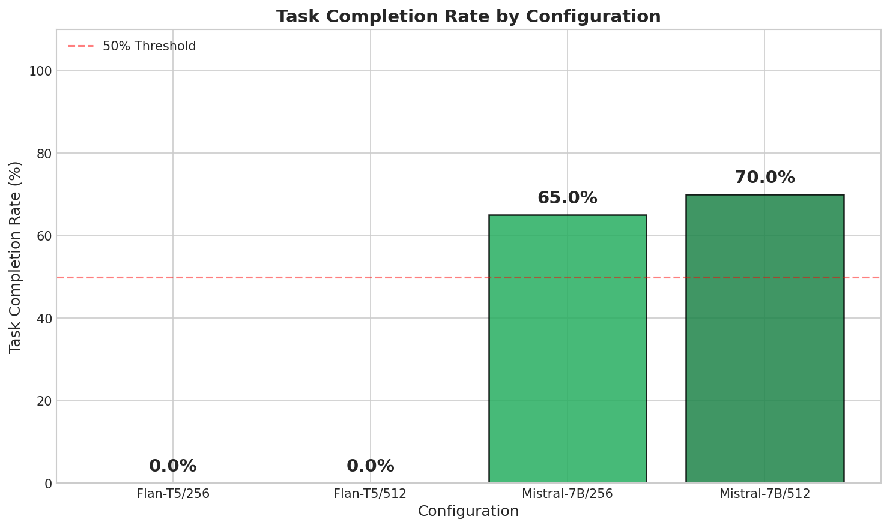
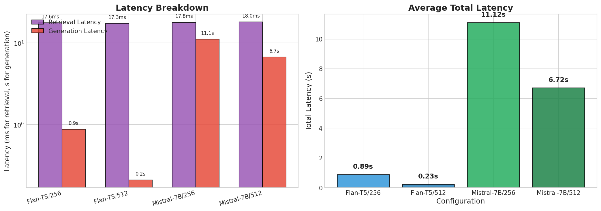
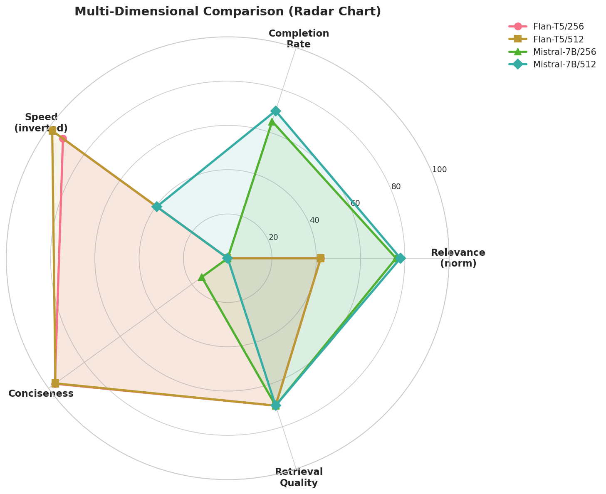
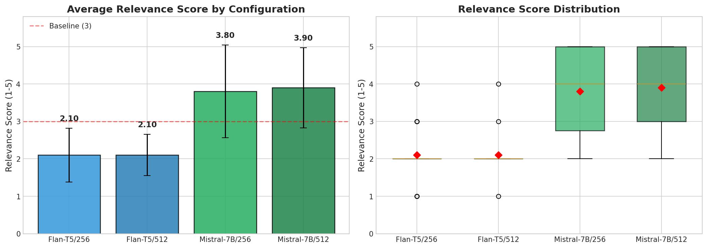
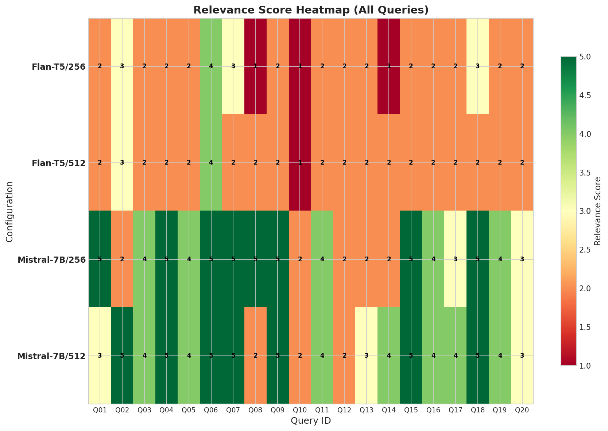
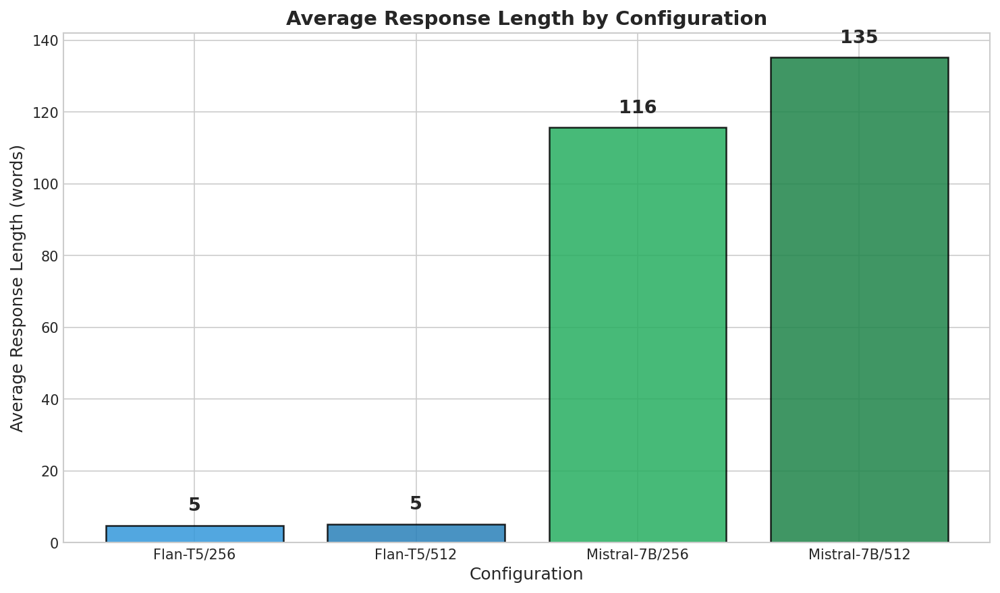

# Building and Evaluating a Document Question Answering System with LlamaIndex: A Study of Chunking Strategies and LLM Backends

A Document Question Answering system built with LlamaIndex, featuring configurable chunking strategies and multiple LLM backends for comparative evaluation.

## Overview

This project implements a Retrieval-Augmented Generation (RAG) system for document question answering. It supports:

- **Configurable chunking strategies** (256 vs 512 tokens with 10% overlap)
- **Multiple LLM backends** (Mistral-7B-Instruct, Flan-T5-base)
- **Comprehensive evaluation** (Relevance, Task Completion, Latency)
- **Reproducible experiments** with proper logging and caching

## Project Structure

```
project-root/
├── data/
│   ├── corpus/                 # Document files (PDF/TXT)
│   └── queries.jsonl           # Evaluation query set
├── configs/
│   ├── chunking_256.yaml       # Fine-grained chunking config
│   └── chunking_512.yaml       # Coarse-grained chunking config
├── notebooks/
│   └── demo_end2end.ipynb      # End-to-end demonstration
├── src/
│   ├── loaders.py              # Document loading & cleaning
│   ├── indexing.py             # Chunking & index construction
│   ├── retriever.py            # Retrieval (vector similarity)
│   ├── llm_backends.py         # LLM backend wrappers
│   ├── rag_pipeline.py         # End-to-end RAG pipeline
│   ├── eval_protocol.py        # Evaluation protocol
│   ├── metrics.py              # Metrics calculation
│   ├── utils.py                # Utility functions
│   ├── run_build_index.py      # CLI: Build indices
│   └── run_eval.py             # CLI: Run evaluations
├── results/
│   ├── logs/                   # Execution logs
│   ├── runs/                   # Experiment outputs
│   └── figures/                # Visualization charts
├── requirements.txt            # Python dependencies
└── README.md                   # This file
```

## Quick Start

### 1. Installation

```bash
# Clone or navigate to project directory
cd "e:\RAG with LlamaIndex"

# Install dependencies
conda create -n llamaindex python=3.10 -y
conda activate llamaindex
pip install torch torchvision --index-url https://download.pytorch.org/whl/cu121
pip install -r requirements.txt
pip install "numpy<2.0" "transformers<5.0"
```

### 2. Add Your Documents

Place your PDF or TXT documents in the `data/corpus/` directory:

```
data/corpus/
├── your_doc1.pdf
├── your_doc2.txt
└── ...
```

The system currently includes sample documents for demonstration.

### 3. Build Indices

Build vector indices for both chunking configurations:

```bash
# Build index with 256-token chunks
python src/run_build_index.py --config configs/chunking_256.yaml

# Build index with 512-token chunks
python src/run_build_index.py --config configs/chunking_512.yaml
```

### 4. Run Evaluations

Run the four experimental configurations:

```bash
# Flan-T5 with 256-token chunks
python src/run_eval.py --llm flant5 --chunk 256

# Flan-T5 with 512-token chunks
python src/run_eval.py --llm flant5 --chunk 512

# Mistral-7B with 256-token chunks (requires GPU)
python src/run_eval.py --llm mistral7b --chunk 256

# Mistral-7B with 512-token chunks (requires GPU)
python src/run_eval.py --llm mistral7b --chunk 512
```

### 5. View Results

Results are saved to `results/runs/`:

- `eval_<llm>_chunk<size>.csv` - Detailed results
- `comparison_table.csv` - Cross-configuration comparison

## Configuration

### Chunking Configurations

Edit `configs/chunking_*.yaml` to customize:

```yaml
chunking:
  chunk_size: 256        # 256 or 512 tokens
  overlap_ratio: 0.1     # 10% overlap

embedding:
  model_name: "sentence-transformers/all-MiniLM-L6-v2"
  device: "cpu"          # "cpu" or "cuda"
```

### LLM Configuration

Modify `src/llm_backends.py` or use command-line options:

```bash
# Adjust generation parameters
python src/run_eval.py --llm flant5 --chunk 256 --max-tokens 512 --temperature 0.3
```

## Evaluation Metrics

| Metric | Description | Scale |
|--------|-------------|-------|
| Response Relevance | Answer quality assessment | 1-5 |
| Task Completion | Whether question was answered correctly | 0/1 |
| Response Length | Word/character count | Continuous |
| Retrieval Latency | Time to retrieve chunks | Seconds |
| Generation Latency | Time to generate answer | Seconds |

## Running the Demo Notebook

```bash
# Start Jupyter
jupyter notebook notebooks/demo_end2end.ipynb

# Or with VS Code
code notebooks/demo_end2end.ipynb
```

## result presentation







## Acknowledgments

- [LlamaIndex](https://www.llamaindex.ai/) - The core framework
- [Hugging Face](https://huggingface.co/) - Model hosting
- [FAISS](https://github.com/facebookresearch/faiss) - Vector similarity search


